# Validator Architecture Overview

This document provides a high-level overview of the terraform-provider-validatefx architecture, explaining how validators, Terraform functions, and integration tests connect.

## Overview

The terraform-provider-validatefx is built with a layered architecture that separates validation logic from Terraform-specific function interfaces. This design promotes code reusability, testability, and maintainability.

### What is a Validator?

A **validator** is a reusable validation rule that checks if a value meets specific criteria. In terraform-provider-validatefx, validators:

- **Encapsulate validation logic** - Each validator implements a single, well-defined validation rule (e.g., checking if a string is valid Base64 or a valid CIDR block)
- **Are framework-agnostic** - Validators are standalone Go structs that don't depend on Terraform directly, making them testable and reusable
- **Provide clear error messages** - When validation fails, validators return descriptive error messages that help users understand what went wrong
- **Handle edge cases** - Validators gracefully handle null, unknown, and empty values according to Terraform semantics

**Example validators include:**
- `Base64Validator()` - Ensures a string is valid Base64 encoded data
- `CIDRValidator()` - Validates CIDR notation (e.g., "10.0.0.0/8")
- `BetweenValidator()` - Checks if a number falls within a range
- `StringContainsValidator()` - Validates that a string contains a specific substring

### Who Uses Validators?

Validators are used by:

1. **Terraform Users** - End-users leverage validators through Terraform configurations when they use the validatefx provider functions
2. **Provider Developers** - If you're building a Terraform provider, you can use these validators to enforce consistent data validation rules
3. **Infrastructure Teams** - Organizations use validators to enforce policy compliance and data quality standards across infrastructure-as-code
4. **Go Developers** - Developers can import and use validators directly in their Go applications for non-Terraform validation needs

### When to Use Validators?

**Use validators when you need to:**

1. **Validate Configuration Input** - Ensure user-provided values in Terraform configurations are correctly formatted
   - Example: Validate that a database password meets complexity requirements
   - Example: Ensure an IP address is in valid CIDR notation

2. **Enforce Data Format Requirements** - Check that data conforms to expected formats
   - Example: Validate email addresses, URLs, UUIDs, Base64 strings
   - Example: Verify JSON or YAML syntax

3. **Ensure Policy Compliance** - Implement organizational policies through validation
   - Example: Require specific naming conventions for resources
   - Example: Enforce tag presence and format

4. **Prevent Configuration Drift** - Catch invalid values before they're deployed
   - Example: Validate environment variable names
   - Example: Check for reserved or restricted values

5. **Improve User Experience** - Provide immediate, clear feedback about configuration errors
   - Example: Show helpful error messages when values don't meet requirements
   - Example: Guide users toward correct formats

### How to Use Validators?

**As a Terraform User:**

You call validators as functions in Terraform configurations:

```hcl
locals {
  # Using the base64 validation function
  encoded_value = "U29sdmluZyB0aGU="
  is_valid_base64 = provider::validatefx::base64(local.encoded_value)
  
  # Using the CIDR validation function
  subnet = "10.0.0.0/24"
  is_valid_cidr = provider::validatefx::cidr(local.subnet)
}

output "base64_check" {
  value = local.is_valid_base64  # Returns true if valid, false if invalid
}
```

**As a Go Developer:**

You import and use validators directly in your code:

```go
import "github.com/The-DevOps-Daily/terraform-provider-validatefx/internal/validators"

// Create a validator instance
validator := validators.Base64Validator()

// Use it in your Terraform schema (if building a provider)
resource := &schema.Resource{
  Schema: map[string]*schema.Schema{
    "encoded_data": {
      Type:     schema.TypeString,
      Required: true,
      Validators: []attr.Validator{
        validators.Base64Validator(),
      },
    },
  },
}
```

**Integration with Provider:**

Validators are registered with the provider and exposed as callable functions that Terraform can invoke during validation:

```mermaid
graph TD
    A["🎯 Terraform Configuration"] -->|invoke provider functions| B["🔌 Provider<br/>internal/provider/provider.go"]
    B -->|register functions| C["📦 Functions Layer<br/>internal/functions/"]
    C -->|wrap validators| D["✓ Validators Layer<br/>internal/validators/"]
    D -->|core logic| E["🔍 Validation Results"] 
    C -->|expose as| F["⚡ Terraform Functions<br/>validatefx::base64()<br/>validatefx::cidr()"]
    F -->|available in| A
    E -->|return to| F
    
    style A fill:#e1f5ff,stroke:#01579b,stroke-width:2px
    style B fill:#f3e5f5,stroke:#4a148c,stroke-width:2px
    style C fill:#fff3e0,stroke:#e65100,stroke-width:2px
    style D fill:#f1f8e9,stroke:#558b2f,stroke-width:2px
    style E fill:#fce4ec,stroke:#880e4f,stroke-width:2px
    style F fill:#e0f2f1,stroke:#004d40,stroke-width:2px
```


## Architecture Flow

### 1. Validators (internal/validators/)

Validators contain the core validation logic and are framework-agnostic implementations that follow the Terraform Plugin Framework's validator interface.

**Structure:**
- Each validator is defined in its own file (e.g., `base64.go`, `cidr.go`)
- Implements the `frameworkvalidator.String` interface
- Provides `Description()`, `MarkdownDescription()`, and `ValidateString()` methods
- Returns validation errors via `resp.Diagnostics.AddAttributeError()`

**Key Points:**
- Validators handle null/unknown values gracefully
- Error messages are clear and actionable
- Each validator includes comprehensive unit tests in `*_test.go` files

### 2. Functions (internal/functions/)

Functions wrap validators and expose them as callable Terraform functions. They use helper functions to reduce boilerplate code.

**Structure:**
- Each function file corresponds to a validator (e.g., `base64.go` -> `Base64Validator()`)
- Uses `newStringValidationFunction()` helper from `common.go`
- Returns `function.Function` interface

**Helper Function:** `internal/functions/common.go`

The `newStringValidationFunction()` helper creates a consistent wrapper that:
- Defines the function signature (string input -> boolean output)
- Handles null/unknown input propagation
- Invokes the underlying validator
- Converts validation results to boolean return values

### 3. Provider Registration (internal/provider/)

The provider registers all available functions so Terraform can discover and use them.

**Key File:** `internal/provider/provider.go`

The `Functions()` method returns all available functions.

**Registry:** `internal/functions/registry.go`

Contains `ProviderFunctionFactories()` which returns a slice of all function constructors.

### 4. Integration Tests (integration/)

Integration tests verify the entire flow works end-to-end with real Terraform configurations.

**Structure:**
- `integration/main.tf` contains Terraform code that calls validation functions
- Tests run in Docker containers for consistency
- Execute via `make integration`

## Extension Points

### Adding a New Validator

To add a new validator, follow this workflow (as documented in `CONTRIBUTING.md`):

1. **Create the Validator** (`internal/validators/<name>.go`)
   - Implement the validator struct and interface methods
   - Add comprehensive tests in `internal/validators/<name>_test.go`

2. **Create the Function** (`internal/functions/<name>.go`)
   - Use `newStringValidationFunction()` helper
   - Add tests in `internal/functions/<name>_test.go`

3. **Register the Function** (`internal/functions/registry.go`)
   - Add `New<Name>Function` to the `ProviderFunctionFactories()` slice

4. **Add Examples** (`examples/functions/<name>/`)
   - Create example Terraform configurations

5. **Add Integration Tests** (`integration/main.tf`)
   - Add test cases for the new function

6. **Generate Documentation** 
   - Run `make docs` to generate function documentation
   - Update README if needed

## Coding Conventions

### File Naming
- Validator files: `internal/validators/<validation_name>.go`
- Function files: `internal/functions/<validation_name>.go`
- Test files: `*_test.go` alongside implementation files

### Testing
- Use table-driven tests for comprehensive coverage
- Test success cases, failure cases, and edge cases (null, unknown, empty)
- Integration tests should cover real-world usage scenarios

### Error Handling
- Use `resp.Diagnostics.AddAttributeError()` for validation failures
- Provide clear, actionable error messages
- Include the problematic value in error messages when safe

### Null/Unknown Handling
- Always check for null or unknown values early
- Return `types.BoolUnknown()` for unknown inputs in functions
- Validators should return early without errors for null/unknown values

## Key Files Reference

| Path | Purpose |
|------|----------|
| `internal/validators/*.go` | Core validation logic implementations |
| `internal/validators/*_test.go` | Validator unit tests |
| `internal/functions/*.go` | Terraform function wrappers |
| `internal/functions/common.go` | Shared helper functions |
| `internal/functions/registry.go` | Function registration |
| `internal/provider/provider.go` | Provider implementation and setup |
| `integration/main.tf` | End-to-end integration tests |
| `examples/functions/*/` | Usage examples for each function |
| `CONTRIBUTING.md` | Detailed contribution workflow |

## Development Workflow

1. **Setup**: `make deps` to install dependencies
2. **Development**: Write validator and function code
3. **Testing**: `make test` for unit tests
4. **Formatting**: `make fmt` to format code
5. **Linting**: `make lint` to check code quality
6. **Documentation**: `make docs` to generate documentation
7. **Integration**: `make integration` to run end-to-end tests
8. **Validation**: `make validate` runs the full CI pipeline locally

## Additional Resources

- [CONTRIBUTING.md](../CONTRIBUTING.md) - Detailed contribution guide
- [CODE_OF_CONDUCT.md](../CODE_OF_CONDUCT.md) - Community guidelines
- [SECURITY.md](../SECURITY.md) - Security policy
- [Terraform Plugin Framework Documentation](https://developer.hashicorp.com/terraform/plugin/framework)
